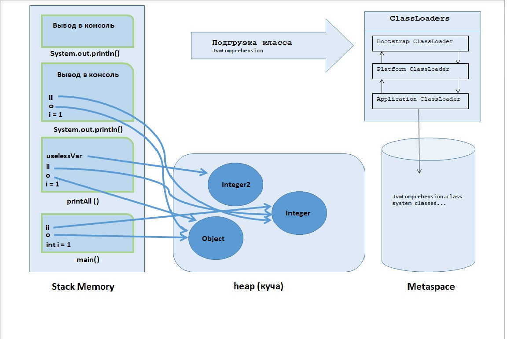

# Задача "Понимание JVM"
## Код
```java
    public class JvmComprehension {
    
        public static void main(String[] args) 
            int i = 1;                      // 1
            Object o = new Object();        // 2
            Integer ii = 2;                 // 3
            printAll(o, i, ii);             // 4
            System.out.println(\"finished\"); // 7
        }
    
        private static void printAll(Object o, int i, Integer ii) {
            Integer uselessVar = 700;                   // 5
            System.out.println(o.toString() + i + ii);  // 6
        }
    }
    
```
## Описание кода с точки зрения происходящего в Java Virtual Machine (JVM)

 - класс "JvmComprehension" подгрузится через подсистему подгрузчика классов (ClassLoaders), а именно через Application ClassLoader;
 - далее, пройдя этапы связывания (Linking) и инициализации (Initialization), данные о классе загружаются в область памяти Metaspace;
 - при выполнении кода класса при переходе к методу "main" создастся фрейм(кадр) в области памяти стек (Stack Memory);
 - в стек записывается переменная i с её значением (//1);
 - создастся объект типа Object и запишется в область памяти куча (heap), а ссылка "o" на этот объект запишется в стеке (//2);
 - создастся объект типа Integer и запишется в область памяти куча, а ссылка "ii" на этот объект запишется в стеке (//3);
 - при переходе к методу "printAll" создастся фрейм в стеке (//4);
 - создастся объект типа Integer и запишется в область памяти куча, а ссылка "uselessVar" на этот объект запишется в стеке (//5);
 - при переходе к методу "println" класса "System" создастся фрейм в стеке. Выполниться метод (вывод строки в консоль).
 После выполнения метода "println" его фрейм удалиться из стека, после выполнения метода "printAll" его фрейм удалиться из стека(//6);
 -  при переходе к методу "println" класса "System" создастся фрейм в стеке. Выполниться метод (вывод строки в консоль).
 После выполнения метода "println" его фрейм удалиться из стека. После выполнения метода "main" его фрейм удалиться из стека. (//7);
 - после завершения работы кода (т.к. код не нагружен и выполниться быстро) запуститься сборщик мусора(Garbage Collection) и очистит кучу от объектов.




